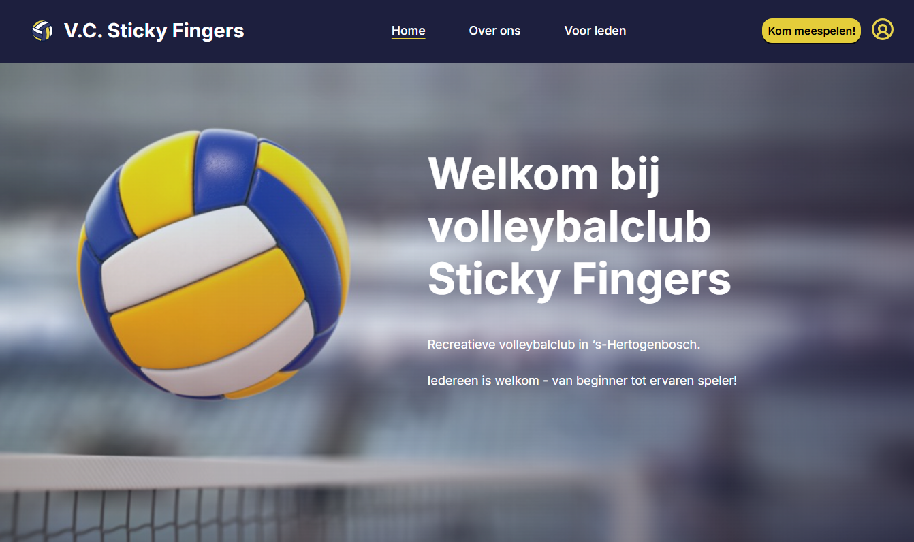

# Website V.C. Sticky Fingers

## Inhoudsopgave

1. Inleiding
2. Screenshot
3. Benodigdheden
4. De applicatie draaien
5. Overige commando's
6. Testgebruikers

## 1. Inleiding

Volleybalclub Sticky Fingers heeft een nieuwe website ontwikkeld! Hiermee willen we nieuwe leden gemakkelijker
bereiken en enthousiasmeren om zich bij onze gezellige club aan te sluiten. Met behulp van het contactformulier kunnen
geïnteresseerden een vraag stellen of een verzoek doen om een keer op proef mee te spelen. Ook kan er een account
aangemaakt worden waarmee je toegang krijgt tot het ledengedeelte van de website. Binnen dit ledengedeelte
inventariseren we hoeveel spelers er op de komende
speelavonden (elke vrijdag) aanwezig zullen zijn. Tenslotte kunnen er peilingen worden ingevuld. Hiermee organiseren we
o.a.
periodiek een gezellig etentje of een andere gezamenlijke activiteit. Lees verder hoe je gemakkelijk
zelf een kijkje kan nemen op onze nieuwe website.

## 2. Screenshot

## 3. Benodigdheden

Om deze applicatie te kunnen gebruiken, zijn de volgende programma's nodig:

- Node.js
- npm
- Webbrowser

Verder is gebruik gemaakt van de volgende technieken en frameworks:

- React: voor het opbouwen van de interface.
- React Router: voor navigatie tussen de verschillende pagina's.
- Vite: voor het starten en bouwen van de applicatie.
- axios: voor het faciliteren van requests.
- date-fns: voor het aanpassen en weergeven van datums.
- jwt-decode: voor het decoderen van tokens.
- vite-plugin-svgr: voor het importeren en gebruiken van SVG-bestanden als React-componenten.

## 4. De applicatie draaien

Je kunt op de volgende manieren toegang krijgen tot de applicatie:

### Via het ZIP-bestand

1. Pak de ZIP-bestanden uit van het project en de json-configuratie. Een `.env`-bestand met daarin de Project-ID is meegeleverd.
2. Open de website van NOVI Dynamic API: https://novi-backend-api-wgsgz.ondigitalocean.app/.
3. Vul de meegeleverde project-ID in onder API Configureren.
4. Upload het bestand [novi-api-config.json](novi-api-config.json). Ingevulde data in dit bestand zijn fictief.
5. Klik op "Upload API configuratie".
6. Open de projectmap.
7. Run in de terminal `npm install`.
8. Start de applicatie met `npm run dev`.
9. Open de gegenereerde localhost-link om de pagina in de webbrowser te bekijken.

### Via GitHub

1. Clone de repository.
2. Vraag project-ID en `.json`-bestand aan bij de auteur.
3. Open de website van NOVI Dynamic API: https://novi-backend-api-wgsgz.ondigitalocean.app/.
4. Vul de project-ID in onder API Configureren.
5. Upload het bestand [novi-api-config.json](novi-api-config.json). Ingevulde data in dit bestand zijn fictief.
6. Klik op "Upload API configuratie".
7. Open de projectmap.
8. Run in de terminal `npm install`.
9. Kopieer `.env.dist` en hernoem de kopie naar `.env`.
10. Vul project-ID in bij `VITE_NOVI_PROJECT_ID` in het `.env`-bestand.
11. Start de applicatie met `npm run dev`.
12. Open de gegenereerde localhost-link om de pagina in de webbrowser te bekijken.

## 5. Overige commando's

Verdere relevante npm commando's zijn:

- `npm run dev`. Applicatie starten in ontwikkelaars-modus, zie ook Stappenplan.
- `npm run build`. Bouwt een productie-versie van de applicatie.
- `npm run lint`. Controle op fouten in de code.
- `npm run preview`. Start lokaal een voorbeeld van de productie.

## 6. Testgebruikers

Testaccounts zijn:

1. E-mailadres: `user.regular@example.com`, wachtwoord: `regular123`.
2. E-mailadres: `user.another@example.com`, wachtwoord: `another123`.

   NB: dit zijn testaccounts zonder persoonlijke gegevens. Er wordt gebruik gemaakt van een API uitsluitend bedoeld
   voor educatieve doeleinden. De database wordt dagelijks automatisch geleegd.

## Veel plezier met het bekijken van onze nieuwe website!
